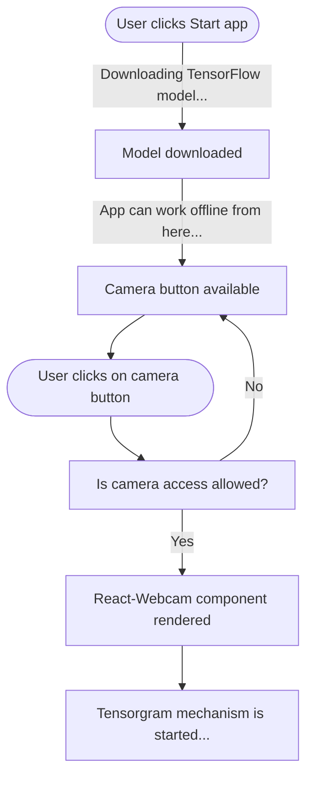

## Introduction

Computer vision is a field of artificial intelligence that deals with the ability of computers to see and understand the world around them. It is a branch of artificial intelligence that deals with the ability of computers to see and understand the world around them. While the models used in computer vision usually require a lot of data and computing power, the TensorFlow.js library makes it possible to use these models in the browser.

Introducing **Scanner Cam**.

## What is Scanner Cam?

**Scanner Cam** is a web application that uses the TensorFlow.js computer vision library to detect objects in real time with the camera of a mobile device or a computer.

### Software Information

- **Project technology**: React, TypeScript, TensorFlow.js, Vercel, PWA
- **Industry**: AI App
- **Work Duration**: ≈4 months
- **Accessibility WCAG**: AA (2.1)
- **Version**: 1.0

## Features

- Detect up to 80 object classes.
- Speech synthesis to talk about objects detected on camera.
- Language internationalization support in English and Spanish.
- Capabilities to work offline.
- Works with two cameras in mobile devices.
- Light and dark mode based on the user's preferred color scheme in the browser.

## Challenges

Many challenges were faced during the development of ScannerCam. Some of them were:

### Reducing the time to response at first load

#### Situation

In the Beta version of ScannerCam, the first load of the app was taking too much time. The reason was that the COCO-SSD model was being downloaded automatically when the app was loaded.

The user had to wait for the model to be downloaded before using the app.

Google Lighthouse was reporting that the app was taking too much time to respond which caused a decrease in the performance score.

#### Solution

Instead of downloading the model automatically when the app was loaded, the model is downloaded when the user clicks on the new **"Start"** button.

The following diagram shows the new flow of the app:




### Accomplishing Accessibility status bar

#### Situation

The progress bar is a very important element. It is a region that contains information about the progress of the download of the COCO-SSD model from 0% to 100%.

But at the beginning, the progress bar was not accessible. Screen Readers were not able to read the progress bar, and also screen readers could not tell when the progress bar reached 100% (the end of the download).

#### Solution

Use ARIA attributes to make the progress bar accessible. Create a new ARIA region to announce the progress bar to the user using ARIA role status. This way, screen readers can read the progress bar and announce when the progress bar reached 100%, which means that the model was downloaded and the app is ready to be used.

## Development Process

### Importing the Neural Network Model

TensorFlow.js is a library for machine learning in JavaScript. It has a set of models that can be used to detect objects in images and videos. The model used in ScannerCam is the COCO-SSD model.

The COCO-SSD model is a pre-trained model that can detect up to 80 object classes. It is based on the SSD (Single Shot MultiBox Detector) algorithm. The COCO-SSD model is trained on the COCO dataset.

### Introducing Tensorgram

**Tensorgram** is a mechanism that is responsible for bringing the frames of the camera to the COCO-SSD model and then painting the boxes with the detected objects on the screen.

The Tensorgram mechanism is a function that is called every time the camera sends a new frame to the app. The function receives the frame as a parameter and returns a React element that is painted on the screen.

Usually this type of function is implemented over a HTML Canvas element. But in this case, the function is implemented over a HTML Div element. This results in a better user experience.

### Integrating Speech Synthesis

Once ScannerCam is detecting objects in real time, it is possible that the app itself talks about the objects detected on camera. This feature is called object-to-voice and it is possible thanks to the Speech Synthesis API.

The Speech Synthesis API is a web standard that allows the web application to talk. It is a part of the Web Speech API. The Speech Synthesis API is supported by all modern browsers.

From every 5000 milliseconds, the app checks if the object-to-voice feature is active. If it is active, the app talks about the objects detected on camera.

Some examples based on the objects detected on camera:

> I am identifying a person and a bycicle.

> I am identifying a dog.

> I am identifying an apple.

#### Mobile support

The Speech Synthesis API is supported by all modern browsers. But it is not _well_ supported by all mobile browsers.

I discovered that the Speech Synthesis API is not supported by the Safari browser on iOS. And the same happens with the Chrome browser on iOS. This is because both browsers use the WebKit engine.

To alert the user about this, the app checks if the Speech Synthesis API is supported by the browser. If it is not supported, the app shows a message to the user:

> ScannerCam: iOS devices do not support object-to-voice unfortunately. But you can use it in Android, Mac or PC.

### Language internationalization

The app supports two languages: English and Spanish. The language change happens by the user's preferred language in the browser.

### User Interface

The UI of ScannerCam was built with TailwindCSS. TailwindCSS is a utility-first CSS framework for rapidly building custom user interfaces.

It is responsive. And it's also available with a beautiful light and dark mode based on the user's preferred color scheme in the browser.

### Testing

Finally I wrote more the tests to ensure that the app is working properly. The tests are located in the `tests` folder.

```
tests
├── about.test.ts
├── basic.test.ts
├── model.test.ts
├── page.test.ts
├── speech.test.ts
```

Currently ScannerCam is continuously tested with Playwright. Playwright is a Node.js library to automate Chromium, Firefox, and WebKit with a single API.

## Future

Future plans for ScannerCam include:

- Progressive Web App (PWA) support.
- Offline-first support.\*
- Unit tests with Jest (or other testing framework).
- Add more languages.

(\*) Currently after the model is downloaded, the app works offline. I am thinking about how to make the app work offline from the beginning storing the model in the browser.

## License

The source code of ScannerCam is distributed under the <a href="https://opensource.org/licenses/MIT" target="_blank">MIT License</a>.

## References

- <a href="https://www.tensorflow.org/js" target="_blank">TensorFlow.js</a>
- <a href="https://www.tensorflow.org/js/models" target="_blank">TensorFlow.js Models</a>
- <a href="https://developer.mozilla.org/en-US/docs/Web/API/SpeechSynthesis" target="_blank">Speech Synthesis API</a>
- <a href="https://developer.mozilla.org/en-US/docs/Web/API/Web_Speech_API" target="_blank">Web Speech API</a>
- <a href="https://tailwindcss.com" target="_blank">TailwindCSS</a>
- <a href="https://vercel.com" target="_blank">Vercel</a>
- <a href="https://playwright.dev" target="_blank">Playwright</a>
